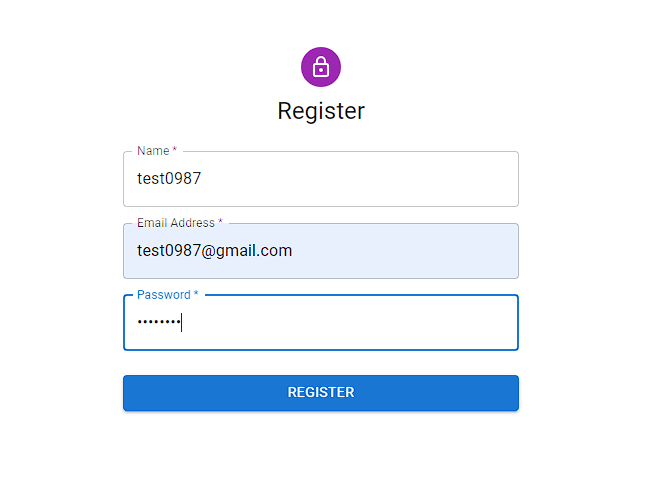
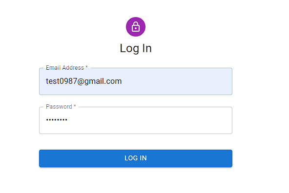
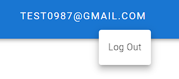
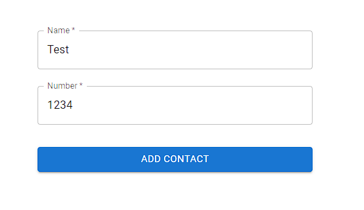
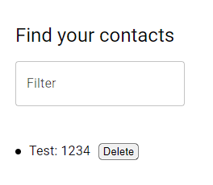
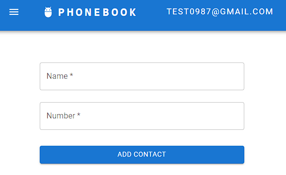

# Phonebook App - project

- This is a web application developed using JavaScript, React, Redux, Axios, MUI Icons, and Emotion for styling. The application provides users with features such as user registration, login, logout, as well as the ability to manage their phone contacts effectively. Users can add, delete, and filter contacts based on specific search phrases.
- Live version [_here_](https://pawelwiteckiwawrzyniak.github.io/phonebook-app-react-project/).

## Table of Contents

- [General Info](#general-information)
- [Technologies Used](#technologies-used)
- [Project Features](#project-features)
- [Project Objectives](#project-objectives)
- [Setup](#setup)

## General Information

- This is a simple project created to expand knowledge and gain
  experience in programming.

## Technologies Used:

- JavaScript
- React
- Redux
- Axios
- MUI Icons
- Emotion library

## Project Features:

- User Authentication:
  - Users can register for an account, log in, and securely log out, ensuring a personalized experience.
    
    
    
- Phonebook Management:
  - Users can add new phone contacts, providing details such as name and phone number.
    
  - Contacts can be deleted, offering flexibility in managing the phonebook.
  - The application enables users to filter contacts based on specific search phrases, enhancing accessibility.
    
- Stylish and Responsive Design:
  - Emotion is employed for styling, ensuring a visually appealing and responsive design for a seamless user experience.
  - The application is designed to be responsive, adapting to users' screen sizes.
    
    
## Project Objectives:

- React and Redux Integration:
  - Developing proficiency in integrating React for building user interfaces and Redux for state management.
- User Authentication and Secure Communication:
  - Implementing user authentication features and utilizing Axios for secure communication with the backend server.
- Interactive User Experience:
  - Creating an interactive interface for adding, deleting, and filtering phone contacts.
- Stylish Design with Emotion:
  - Leveraging Emotion for efficient styling, allowing for a visually pleasing and responsive design.

## Setup

To run this project, install it locally using npm:

```
npm i
npm start
```
