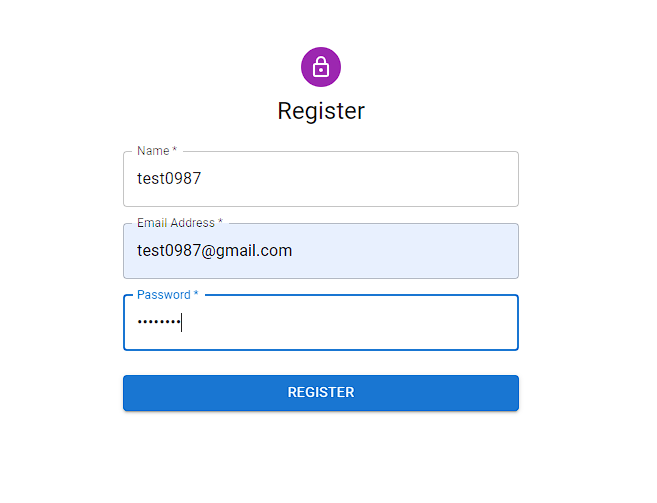
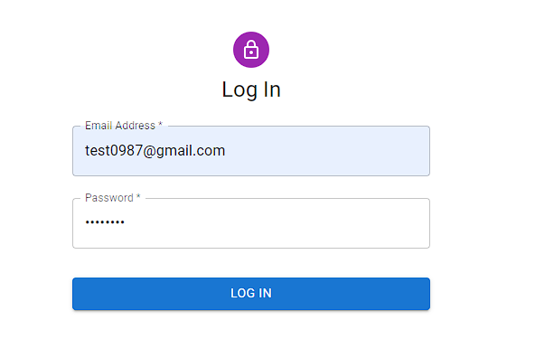
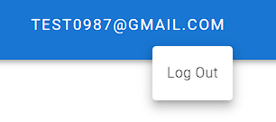
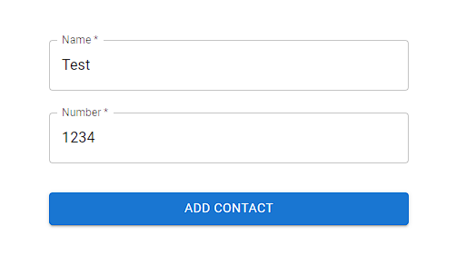
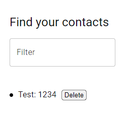
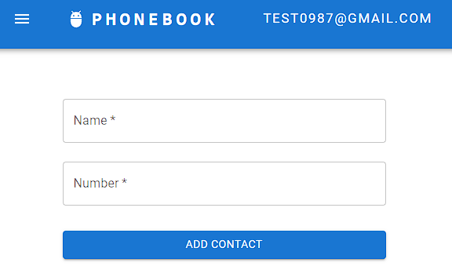

# Phonebook App - project
- A React-based Single Page Application (SPA) for managing a personal contact list. The app features user authentication and full contact management capabilities.

## Technologies Used:
- JavaScript
- React
- Redux
- Axios
- MUI Icons
- Emotion library

## Key Features
- **State Management:** Redux handles global application state (user auth session and contacts list).
    
    
    
- **Contact Management:** Add new contacts, delete entries, and filter the list by search phrase.
    
    
- **UI Styling:** Responsive layout built using Emotion (CSS-in-JS) and MUI Icons.
    

## Setup
To run this project, install it locally using npm:

```
npm i
npm start
```

---

Deprecated

